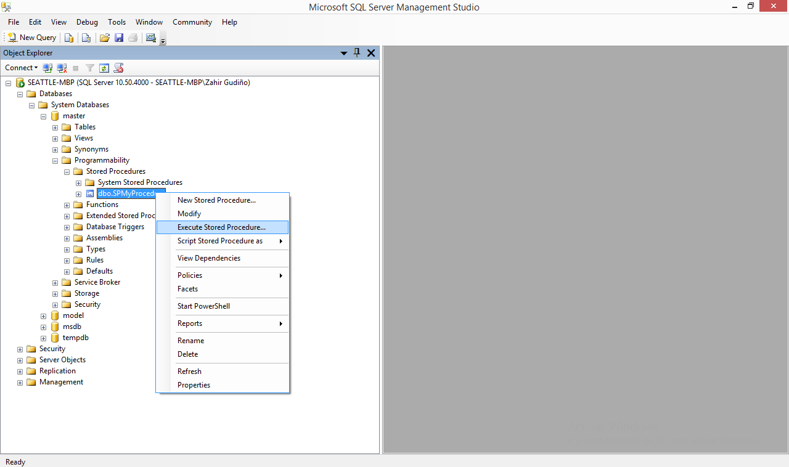

# SPSyncTaskAssortments
> Sincroniza pedidos de surtidos hacia SAP®

## Descripcion
Colecciona todo pedidos de surtidos completados en BarcodeBox. __SPSyncTaskAssortments__ se diferencia por las condiciones `supCode = PI-CWW` y `cstCode = CWW`.

## Uso
Para ejecutar individualmente `SPSyncTaskPurchases` abra un nueva pestana de query de __Microsoft SQL Studio Management®__ o simplemente __SQLCMD__.

```sql
EXECUTE B1BBIL.dbo.SPSyncTaskAssortments
GO
```

O, muy bien con el dialogo de menu del Object Explorer __Microsoft SQL Studio Management®__.


