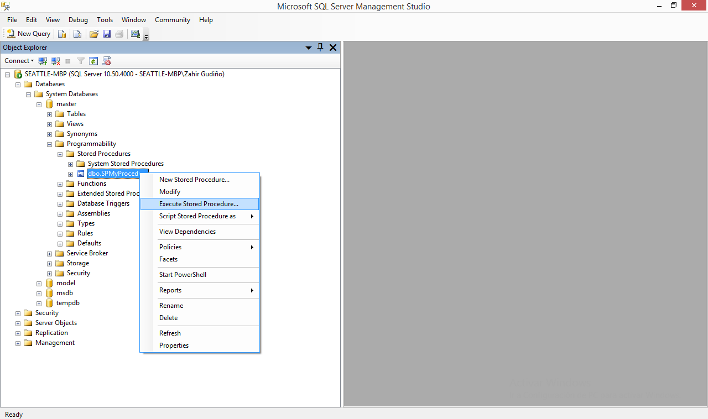

# SPSyncTaskSales
> SP sincroniza pedidos entre tiendas hacia Sap®

## Uso
Para ejecutar individualmente `SPSyncTaskPurchases` abra un nueva pestana de query de __Microsoft SQL Studio Management®__ o simplemente __SQLCMD__.

```sql
EXECUTE B1BBIL.dbo.SPSyncTaskSales
GO
```

O, muy bien con el dialogo de menu del Object Explorer __Microsoft SQL Studio Management®__.



